[](https://GitHub.com/georgetegral/udacity-cicd-pipeline-azure/actions/workflows/pythonapp.yml)

# Building a CI/CD Pipeline with GitHub Actions and Azure Pipelines

## Table of Contents
* [Overview](#Overview)
* [Project Plan](#Project-Plan)
* [Architecture](#Architecture)
* [Instructions](#Instructions)
    * [Deploy the app in Azure Cloud Shell](#Deploy-the-app-in-Azure-Cloud-Shell)
    * [Configure GitHub Actions (Optional)](#configure-github-actions-optional)
    * [Deploy the app into an Azure App Service](#Deploy-the-app-into-an-Azure-App-Service)
    * [Configure Azure Pipelines](#Configure-Azure-Pipelines)
    * [Logging](#Logging)
    * [Load Testing](#Load-Testing)
* [Future Improvements](#Future-Improvements)
* [Demo](#Demo)
* [References](#References)

## Overview

This is a submission for the second project of the Udacity DevOps engineer with Microsoft Azure Nanodegree.

The project consists of a Python Flask application that uses a Machine Learning model to predict housing prices in Boston.

This project is a template for deploying a Flask microservice, and it shows the implementation of both GitHub Actions and Azure Pipelines. Finally, the project is deployed with Azure Pipelines to an App Service which uses Python 3.7.

Any commits to the GitHub repository will trigger a build in Azure DevOps, which tests the code and then deploys it to the App Service.

## Project Plan
This project followed the Agile Project Management Process. The planning is divided between a Trello board and a spreadsheet explaining the plan followed for the project.

* Tasks for this project were planned with a Trello board, you can check them the following URL: [Link](https://trello.com/b/tc06w54F/udacity-ci-cd-pipelines-azure)
* A project plan was made with a Google Sheet, you can check it in the following URL: [Link](https://docs.google.com/spreadsheets/d/1e66Pa2Z3KnZdFRo2v-h5joDtRpxOj-HCT_1vKzOCET8/edit?usp=sharing)

## Architecture
This is the Architectural Diagram for the project

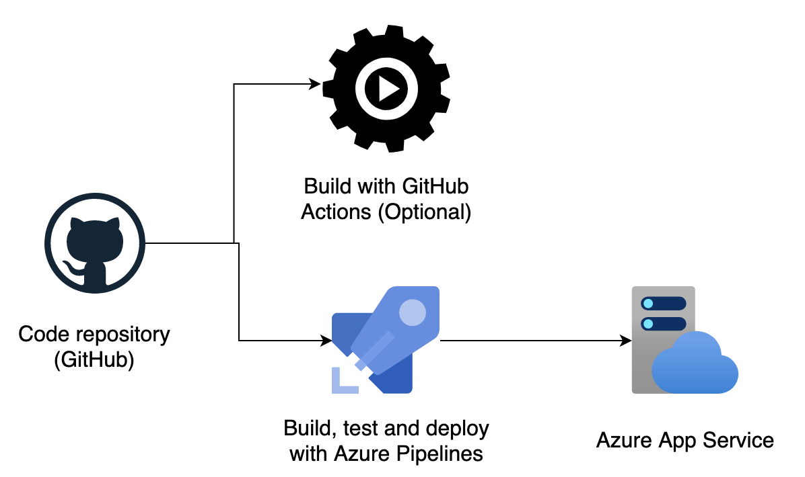

GitHub will serve as our code repository. For this project we used GitHub Actions to demonstrate the functionality, but in reality Azure Pipelines was used to build, test and deploy the code, finally it is deployed to an Azure App Service.

## Instructions

### Deploy the app in Azure Cloud Shell

The first step is to add SSH Keys from your Azure Cloud Shell into GitHub

1. Open the Azure Cloud Shell.
2. Create an SSH key with ```ssh-keygen -t rsa```.
3. Show the key with ```cat ~/.ssh/id_rsa.pub```.
4. Copy the SSH key.
5. Go to GitHub Settings and click SSH and GPG Keys.
6. Go to New SSH Key.
7. Paste the SSH key.
8. Click Add SSH Key.
9. The new key should appear.

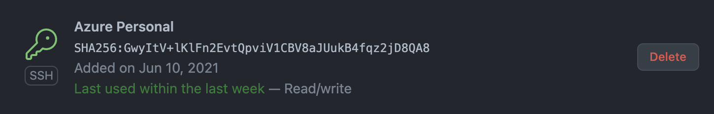

In Azure Cloud Shell, clone this repository.

```Bash
git clone git@github.com:georgetegral/udacity-cicd-pipeline-azure.git
```

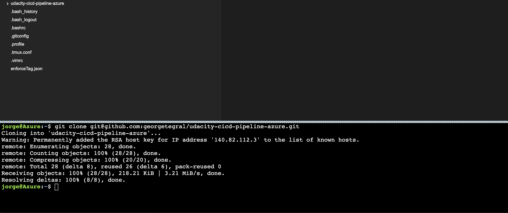

Then you should setup a new virtual environment.

```Bash
python3 -m venv ~/.myrepo
source ~/.myrepo/bin/activate
```
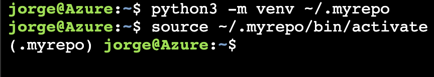

The next step is to go to the project and run the Makefile, all the tests should pass.

```Bash
cd udacity-cicd-pipeline-azure
make all
```

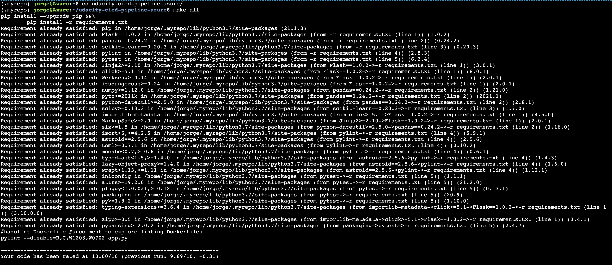

Now we can test the microservice locally, for this we can start the application in the local environment and in a separate terminal test that the app is working.

```Bash
python app.py
```

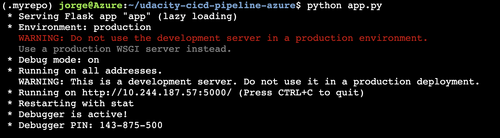

We have to get a prediction, if it fails be sure that the port that the Flask app is running is the same in the ```make_prediction.sh``` file.

```Bash
bash ./make_prediction.sh
```

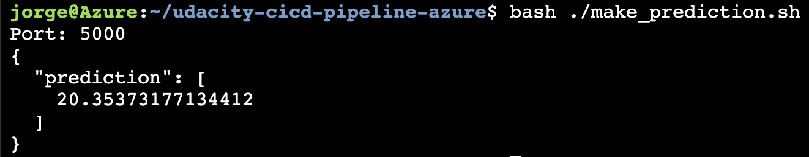

### Configure GitHub Actions (Optional)
We can set up Github Actions to build the project whenever changes are pushed into GitHub.
1. In the GitHub repo, navigate to actions.
2. Click on ```set up a workflow yourself```

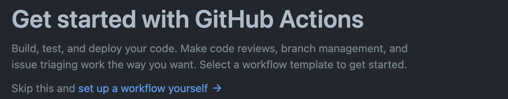

3. We will see a space to edit a .yml file name and its contents, for this example we will use the name ```pythonapp.yml```, and the contents will be the ones available in our ```pythonapp.yml``` file, you can copy and paste them into your project.

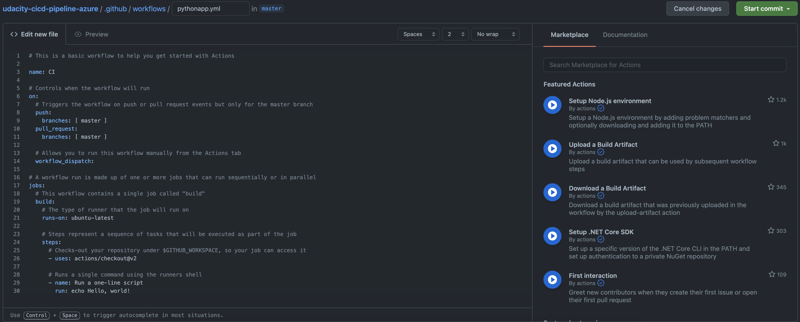

4. Our Workflow is named Python application test with Github Actions, for each commit we make on the repo, the workflow will be run.

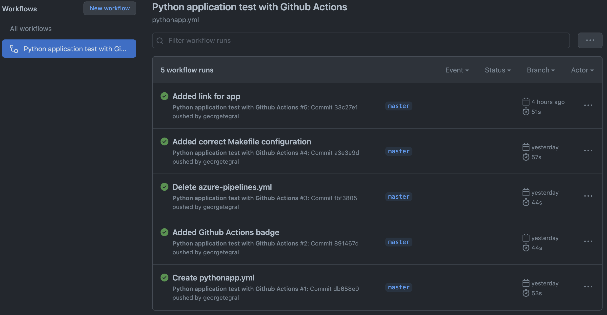

5. We can add a badge to represent our build status by clicking the button with the 3 dots, and then clicking 'Create status badge'. This we will copy and paste at the start of our ```README.md``` file


### Deploy the app into an Azure App Service

The next step is to deploy the app into an Azure App Service. We can deploy it using the Azure Portal, but we will do it using the CLI. In this App Service we will later configure our Pipeline.

```Bash
az webapp up -n udacityflaskml
```

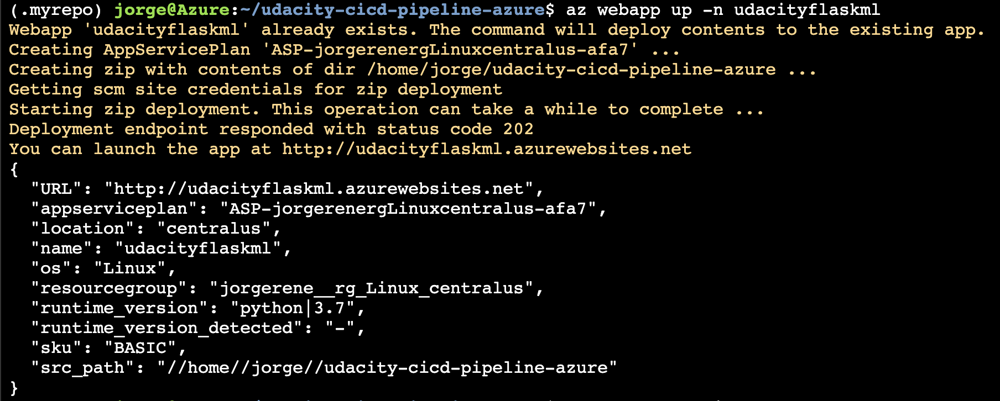

After deploying, we should wait for a few minutes and then we can test our endpoint with the ```make_predict_azure_app.sh```, just be sure to change the url to be the correct one for your service.

```Bash
sh make_predict_azure_app.sh
```

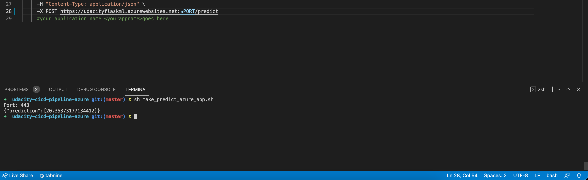

We can check the service running in the Azure Portal

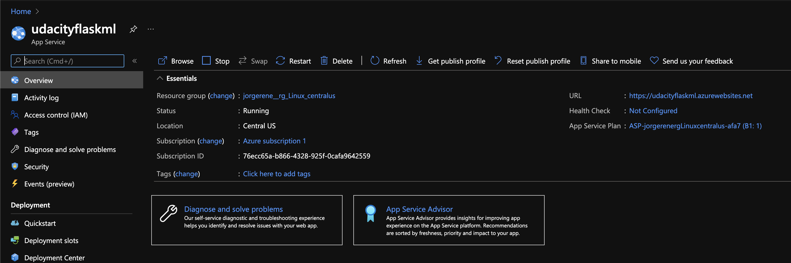

### Configure Azure Pipelines

Please refer to the official Azure Pipelines documentation for a more in-depth explanation in the following URL: [Link](https://docs.microsoft.com/en-us/azure/devops/pipelines/ecosystems/python-webapp?view=azure-devops)

We will visit our Azure DevOps organization and create a new private project, in our case we already have a project named 'Flask-ML-Deploy' but it was important to show the screenshot for creating a new project.

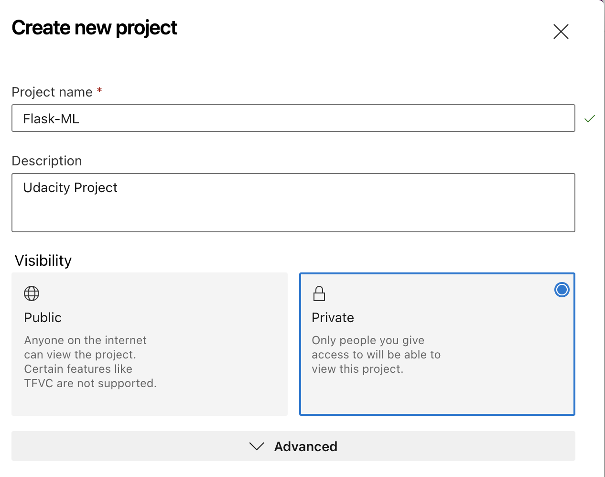

We will select the Flask-ML-Deploy project, and then go to the Pipelines section.

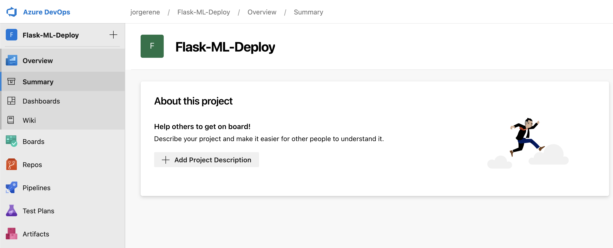

We will follow the following steps to configure our Pipeline:

1. In Connect, select GitHub.

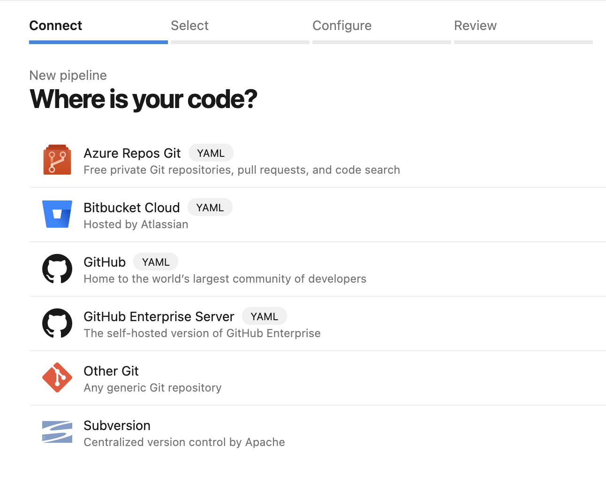

2. In Select, select the repository, in our case it will be udacity-cicd-pipeline-azure.

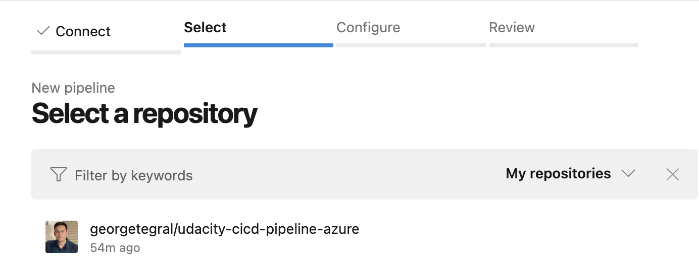

3. In Configure, select ```Python to Linux Web App on Azure```.

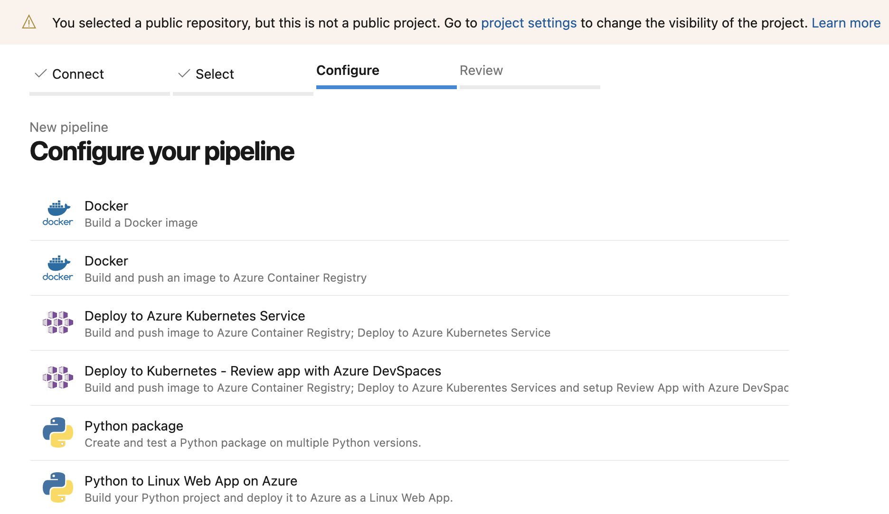

4. In the menu that appears, select the Azure Subscription.

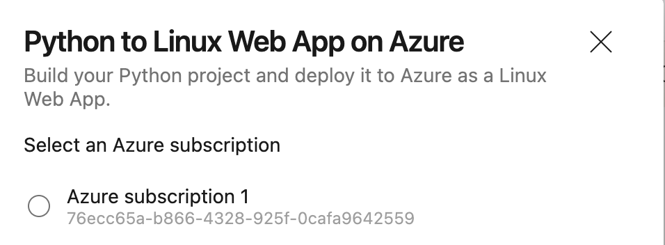

4. Select the Web App, in our case we will use ```udacityflaskml```.

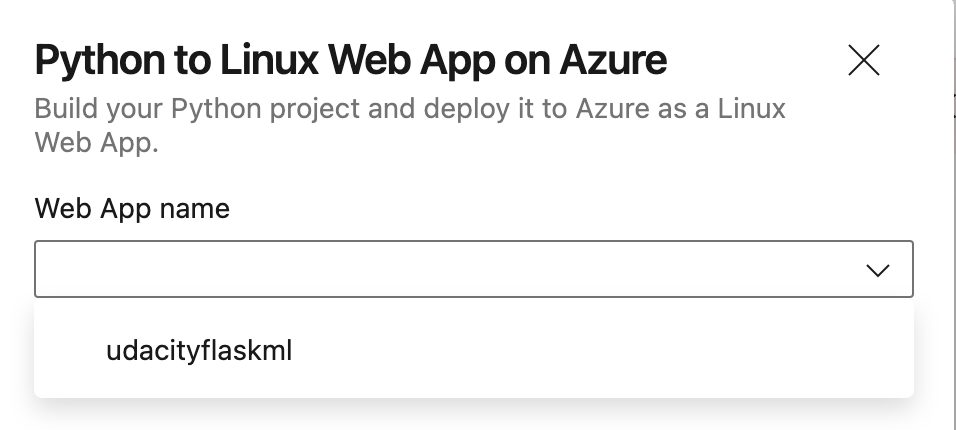

5. In Review we can check the configuration that will be used, in our case we will use commits to ```master``` as our trigger, so we can leave our file as it is. Click on ```Save and run```

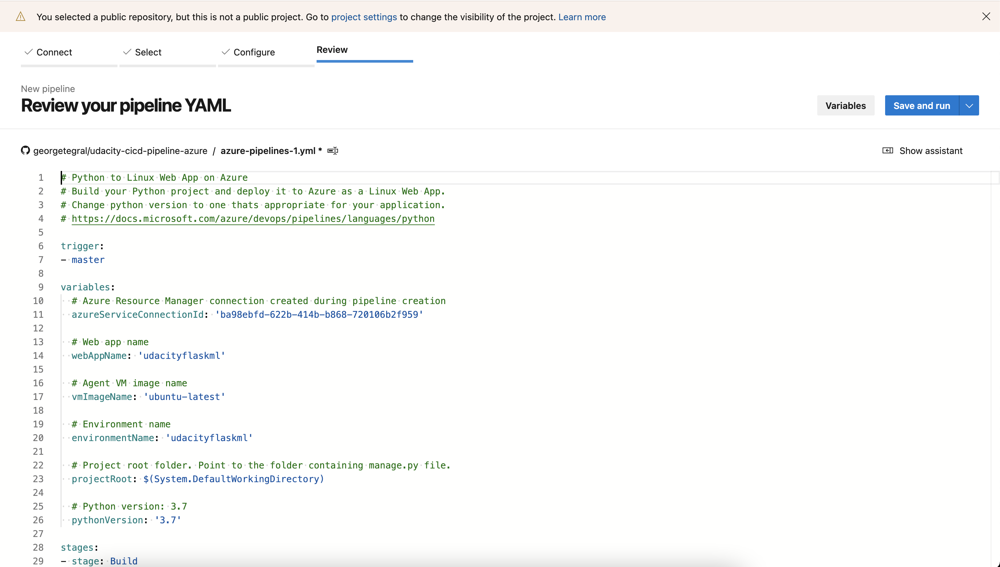

6. In the Save and run menu we can just leave the Commit message as is and finally hit ```Save and run``` at the bottom of the menu, when we do that we just have to wait some minutes for our pipeline to execute.

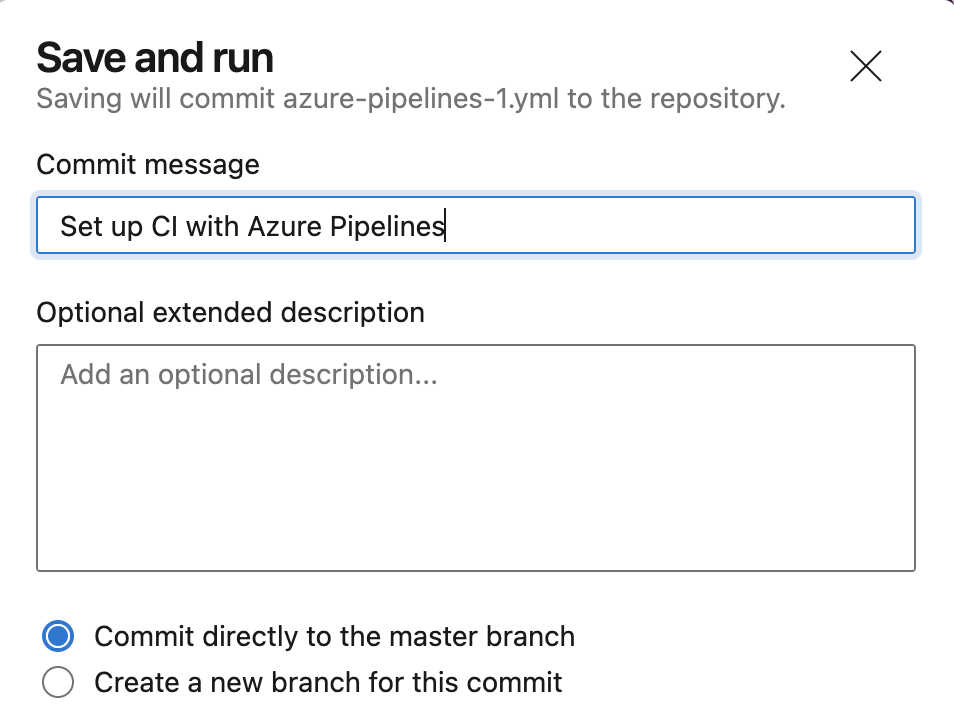

7. We can see the process in which our pipeline runs, in this case it took around 7 minutes, but the pipeline ran successfully.

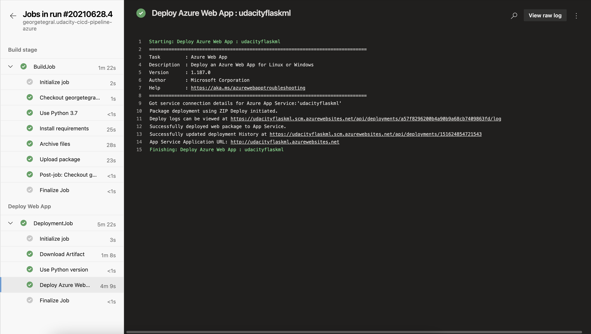

### Logging

Now that the Pipeline is working and the app is deployed, we can use logs streaming and make a request to verify everything is working as expected.

To run logs we can use the following command:

```Bash
az webapp log tail --resource-group jorgerene__rg_Linux_centralus -n udacityflaskml
```

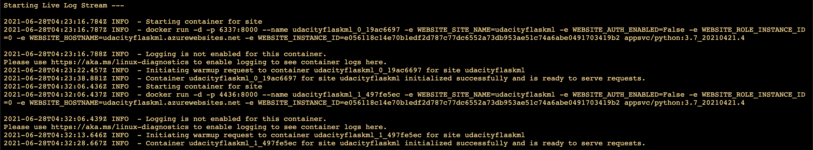

And we can make a prediction with the following command:

```Bash
sh make_predict_azure_app.sh
```

We can verify the service is still serving successful requests

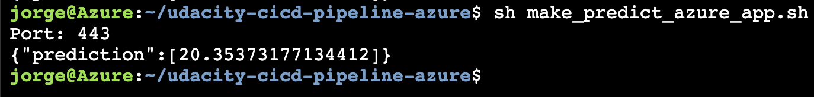

### Load Testing

For Load Testing we can use ```Locust``` to load test our application.

To install Locust run the following command:

```Python
pip install locust
```

We now have to create a locustfile, this is available in the ```locustfile.py```, there we can check the configuration used.

Start Locust:

```Python
locust
```

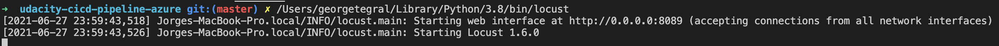

In our terminal the Locust URL is available, we can access the Locust UI from our browser

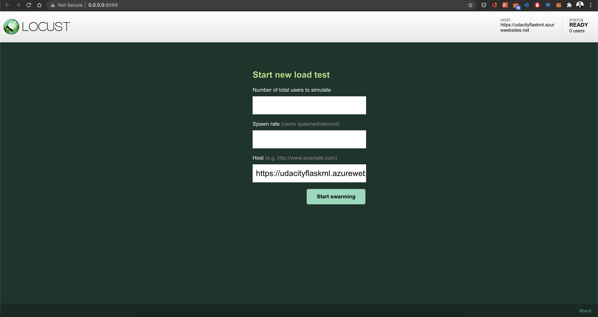

We will put the Number of users to 10, and the spawn rate to 1. To start the load test we can click on ```Start swarming```

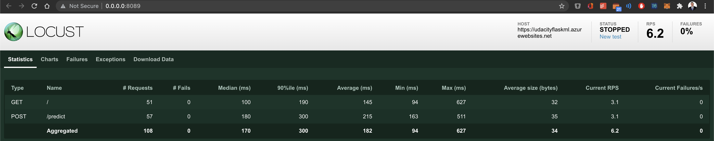

We get 0% failures, this is because we specified the body for the tests to the ```/predict``` endpoint, we can also check the results Locust gives in the terminal

```Bash
[2021-06-28 00:15:36,908] Jorges-MacBook-Pro.local/INFO/locust.main: Starting web interface at http://0.0.0.0:8089 (accepting connections from all network interfaces)
[2021-06-28 00:15:36,917] Jorges-MacBook-Pro.local/INFO/locust.main: Starting Locust 1.6.0
[2021-06-28 00:15:42,535] Jorges-MacBook-Pro.local/INFO/locust.runners: Spawning 10 users at the rate 1 users/s (0 users already running)...
[2021-06-28 00:15:51,557] Jorges-MacBook-Pro.local/INFO/locust.runners: All users spawned: WebsiteTest: 10 (10 total running)
[2021-06-28 00:16:04,571] Jorges-MacBook-Pro.local/INFO/locust.runners: Stopping 10 users
[2021-06-28 00:16:04,574] Jorges-MacBook-Pro.local/INFO/locust.runners: 10 Users have been stopped, 0 still running
KeyboardInterrupt
2021-06-28T05:16:32Z
[2021-06-28 00:16:32,418] Jorges-MacBook-Pro.local/INFO/locust.main: Running teardowns...
[2021-06-28 00:16:32,418] Jorges-MacBook-Pro.local/INFO/locust.main: Shutting down (exit code 0), bye.
[2021-06-28 00:16:32,418] Jorges-MacBook-Pro.local/INFO/locust.main: Cleaning up runner...
 Name                                                          # reqs      # fails  |     Avg     Min     Max  Median  |   req/s failures/s
--------------------------------------------------------------------------------------------------------------------------------------------
 GET /                                                             51     0(0.00%)  |     144      94     627     100  |    2.34    0.00
 POST /predict                                                     57     0(0.00%)  |     214     163     511     180  |    2.61    0.00
--------------------------------------------------------------------------------------------------------------------------------------------
 Aggregated                                                       108     0(0.00%)  |     181      94     627     170  |    4.95    0.00

Response time percentiles (approximated)
 Type     Name                                                              50%    66%    75%    80%    90%    95%    98%    99%  99.9% 99.99%   100% # reqs
--------|------------------------------------------------------------|---------|------|------|------|------|------|------|------|------|------|------|------|
 GET      /                                                                 100    100    110    140    190    420    490    630    630    630    630     51
 POST     /predict                                                          180    200    210    210    300    480    490    510    510    510    510     57
--------|------------------------------------------------------------|---------|------|------|------|------|------|------|------|------|------|------|------|
 None     Aggregated                                                        170    180    190    200    300    470    490    510    630    630    630    108
```

## Future improvements

* We could divide the repository between different branches, so that different branches are deployed to different App Services.
* We can create another version of the project where we only use Github Actions instead of Azure Pipelines.

## Demo 

In the following URL we can see a screencast with a demonstration of the work done. 

## References
- [Azure Pipelines documentation](https://docs.microsoft.com/en-us/azure/devops/pipelines/ecosystems/python-webapp?view=azure-devops)
- [Udacity Starter Files](https://github.com/udacity/nd082-Azure-Cloud-DevOps-Starter-Code/tree/master/C2-AgileDevelopmentwithAzure/project/starter_files/flask-sklearn)
- [Locust Load Testing Tool](https://locust.io/)