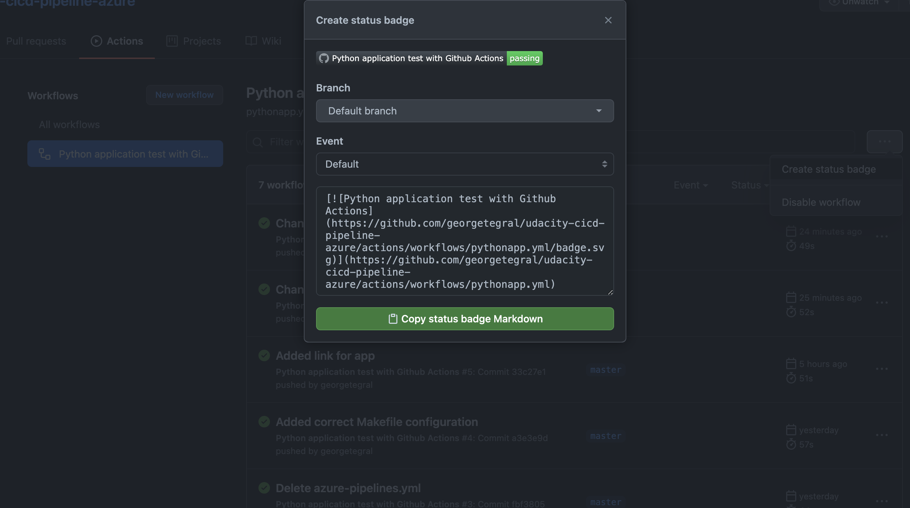

[](https://GitHub.com/georgetegral/udacity-cicd-pipeline-azure/actions/workflows/pythonapp.yml)

# Building a CI/CD Pipeline with GitHub Actions and Azure Pipelines

## Table of Contents
* [Overview](#Overview)
* [Project Plan](#Project-Plan)
* [Architecture](#Architecture)
* [Instructions](#Instructions)
    * [Deploy the app in Azure Cloud Shell](#Deploy-the-app-in-Azure-Cloud-Shell)
    * [Configure GitHub Actions (Optional)](#configure-github-actions-optional)
    * [Deploy the app into an Azure App Service](#Deploy-the-app-into-an-Azure-App-Service)
    * [Configure Azure Pipelines](#Configure-Azure-Pipelines)
* [Enhancements](#Enhancements)
* [Demo](#Demo)
* [References](#References)

## Overview

This is a submission for the second project of the Udacity DevOps engineer with Microsoft Azure Nanodegree.

The project consists of a Python Flask application that uses a Machine Learning model to predict housing prices in Boston.

This project is a template for deploying a Flask microservice, and it shows the implementation of both GitHub Actions and Azure Pipelines. Finally, the project is deployed with Azure Pipelines to an App Service which uses Python 3.7.

Any commits to the GitHub repository will trigger a build in Azure DevOps, which tests the code and then deploys it to the App Service.

## Project Plan
This project followed the Agile Project Management Process. The planning is divided between a Trello board and a spreadsheet explaining the plan followed for the project.

* Tasks for this project were planned with a Trello board, you can check them the following URL: [Link](https://trello.com/b/tc06w54F/udacity-ci-cd-pipelines-azure)
* A project plan was made with a Google Sheet, you can check it in the following URL: [Link](https://docs.google.com/spreadsheets/d/1e66Pa2Z3KnZdFRo2v-h5joDtRpxOj-HCT_1vKzOCET8/edit?usp=sharing)

## Architecture
This is the Architectural Diagram for the project


GitHub will serve as our code repository. For this project we used GitHub Actions to demonstrate the functionality, but in reality Azure Pipelines was used to build, test and deploy the code, finally it is deployed to an Azure App Service.

## Instructions

### Deploy the app in Azure Cloud Shell

The first step is to add SSH Keys from your Azure Cloud Shell into GitHub

1. Open the Azure Cloud Shell.
2. Create an SSH key with ```ssh-keygen -t rsa```.
3. Show the key with ```cat ~/.ssh/id_rsa.pub```.
4. Copy the SSH key.
5. Go to GitHub Settings and click SSH and GPG Keys.
6. Go to New SSH Key.
7. Paste the SSH key.
8. Click Add SSH Key.
9. The new key should appear.


In Azure Cloud Shell, clone this repository.

```Bash
git clone git@github.com:georgetegral/udacity-cicd-pipeline-azure.git
```


Then you should setup a new virtual environment.

```Bash
python3 -m venv ~/.myrepo
source ~/.myrepo/bin/activate
```


The next step is to go to the project and run the Makefile, all the tests should pass.

```Bash
cd udacity-cicd-pipeline-azure
make all
```


Now we can test the microservice locally, for this we can start the application in the local environment and in a separate terminal test that the app is working.

```Bash
python app.py
```


We have to get a prediction, if it fails be sure that the port that the Flask app is running is the same in the ```make_prediction.sh``` file.

```Bash
bash ./make_prediction.sh
```


### Configure GitHub Actions (Optional)
We can set up Github Actions to build the project whenever changes are pushed into GitHub.
1. In the GitHub repo, navigate to actions.
2. Click on ```set up a workflow yourself```


3. We will see a space to edit a .yml file name and its contents, for this example we will use the name ```pythonapp.yml```, and the contents will be the ones available in our ```pythonapp.yml``` file, you can copy and paste them into your project.


4. Our Workflow is named Python application test with Github Actions, for each commit we make on the repo, the workflow will be run.


5. We can add a badge to represent our build status by clicking the button with the 3 dots, and then clicking 'Create status badge'. This we will copy and paste at the start of our ```README.md``` file



### Deploy the app into an Azure App Service

The next step is to deploy the app into an Azure App Service. We can deploy it using the Azure Portal, but we will do it using the CLI. In this App Service we will later configure our Pipeline.

```Bash
az webapp up -n udacityflaskml
```


After deploying, we should wait for a few minutes and then we can test our endpoint with the ```make_predict_azure_app.sh```, just be sure to change the url to be the correct one for your service.

```Bash
sh make_predict_azure_app.sh
```


We can check the service running in the Azure Portal


### Configure Azure Pipelines

Please refer to the official Azure Pipelines documentation for a more in-depth explanation in the following URL: [Link](https://docs.microsoft.com/en-us/azure/devops/pipelines/ecosystems/python-webapp?view=azure-devops)


<TODO:  Instructions for running the Python project.  How could a user with no context run this project without asking you for any help.  Include screenshots with explicit steps to create that work. Be sure to at least include the following screenshots:

* Project running on Azure App Service

* Project cloned into Azure Cloud Shell

* Passing tests that are displayed after running the `make all` command from the `Makefile`

* Output of a test run

* Successful deploy of the project in Azure Pipelines.  [Note the official documentation should be referred to and double checked as you setup CI/CD](https://docs.microsoft.com/en-us/azure/devops/pipelines/ecosystems/python-webapp?view=azure-devops).

* Running Azure App Service from Azure Pipelines automatic deployment

* Successful prediction from deployed flask app in Azure Cloud Shell.  [Use this file as a template for the deployed prediction](https://GitHub.com/udacity/nd082-Azure-Cloud-DevOps-Starter-Code/blob/master/C2-AgileDevelopmentwithAzure/project/starter_files/flask-sklearn/make_predict_azure_app.sh).
The output should look similar to this:

```bash
udacity@Azure:~$ ./make_predict_azure_app.sh
Port: 443
{"prediction":[20.35373177134412]}
```

* Output of streamed log files from deployed application

> 

## Enhancements

<TODO: A short description of how to improve the project in the future>

## Demo 

<TODO: Add link Screencast on YouTube>


## References
- [Azure Pipelines documentation](https://docs.microsoft.com/en-us/azure/devops/pipelines/ecosystems/python-webapp?view=azure-devops)
- [Udacity Starter Files](https://github.com/udacity/nd082-Azure-Cloud-DevOps-Starter-Code/tree/master/C2-AgileDevelopmentwithAzure/project/starter_files/flask-sklearn)
